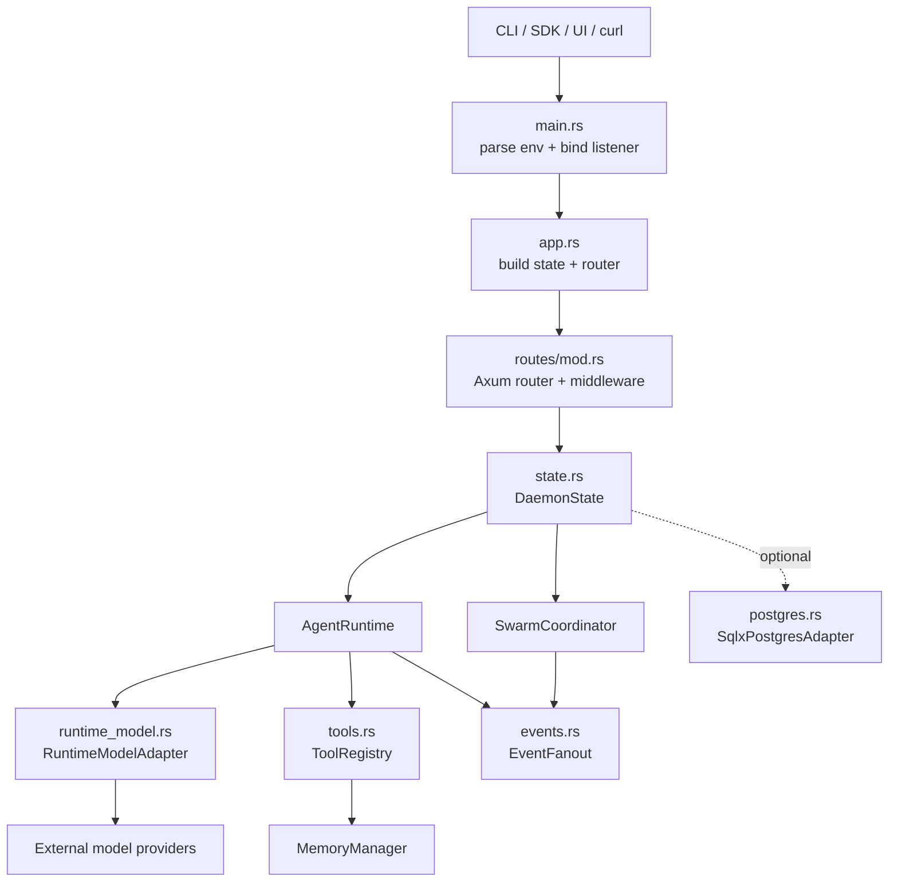
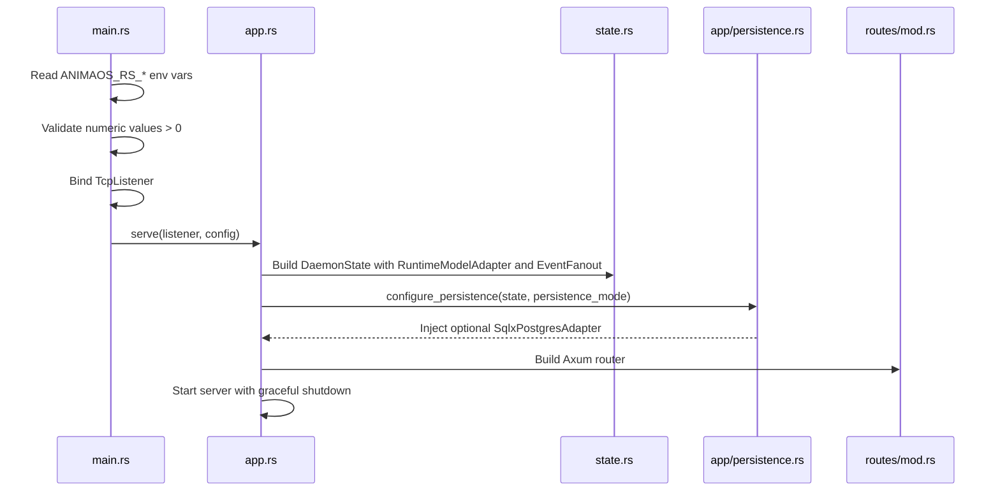
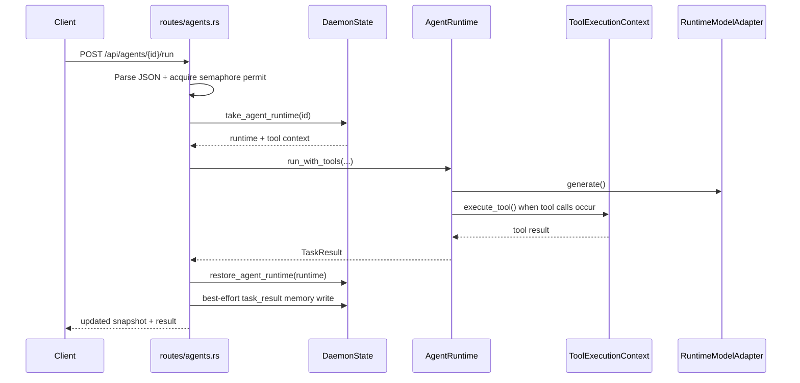

# Rust Daemon Architecture

This document explains how the runnable Rust host in `hosts/rust-daemon` works today.

It complements `hosts/rust-daemon/README.md`:

- The README is the operator-facing surface for URLs, env vars, and routes.
- This doc is the implementation-facing walkthrough for startup, state ownership, request flow, and module responsibilities.

## What The Daemon Is

`anima-daemon` is the current Axum-based HTTP and SSE boundary for animaOS.

Its job is to:

1. Accept HTTP requests from the CLI, SDK, UI, or other local clients.
2. Own live in-process `AgentRuntime` and `SwarmCoordinator` instances.
3. Route model calls through `RuntimeModelAdapter` to real providers such as OpenAI-compatible APIs, Anthropic, Google, Ollama, Groq, Moonshot, and others.
4. Expose the daemon tool surface through a shared `ToolRegistry` and `ToolExecutionContext`.
5. Stream swarm events over SSE.
6. Optionally attach a Postgres-backed `DatabaseAdapter` for step-log persistence.

The daemon is explicitly an `ephemeral` control plane. Live agent and swarm runtime state is held in memory. Enabling Postgres adds step durability, but it does not turn the daemon into a fully durable process-level state store across restarts.

## High-Level Shape

## Module Map

| Module | Responsibility |
|---|---|
| `hosts/rust-daemon/src/main.rs` | Reads env vars, validates config, binds the TCP listener, initializes tracing, and starts the daemon. |
| `hosts/rust-daemon/src/app.rs` | Defines `DaemonConfig`, builds shared state, wires persistence, and serves the Axum app with graceful shutdown. |
| `hosts/rust-daemon/src/app/persistence.rs` | Handles `memory` vs `postgres` persistence startup and injects the `SqlxPostgresAdapter` when enabled. |
| `hosts/rust-daemon/src/routes/mod.rs` | Owns the router, request middleware, timeout policy, run admission semaphore, OpenAPI, and Scalar docs wiring. |
| `hosts/rust-daemon/src/routes/agents.rs` | Create, list, fetch, delete, recent-memory, and run handlers for agents. |
| `hosts/rust-daemon/src/routes/memories.rs` | HTTP surface for memory create, recent, and search operations. |
| `hosts/rust-daemon/src/routes/swarms.rs` | Create, list, fetch, run, and SSE subscription handlers for swarms. |
| `hosts/rust-daemon/src/routes/health.rs` | Liveness, readiness, and metrics computation. |
| `hosts/rust-daemon/src/state.rs` | Shared daemon control-plane state: memory, runtimes, swarms, snapshots, event fanout, tool registry, process manager, and optional database adapter. |
| `hosts/rust-daemon/src/runtime_model.rs` | Provider routing layer that turns core model requests into real HTTP requests for supported providers. |
| `hosts/rust-daemon/src/components.rs` | Default providers and evaluators attached to new runtimes. |
| `hosts/rust-daemon/src/tools.rs` | Tool registry and shared execution context for memory, web, filesystem, todo, utility, and process tools. |
| `hosts/rust-daemon/src/events.rs` | Lightweight broadcast fanout used for internal event publishing and SSE subscribers. |

## Startup Flow

Startup is split between `main.rs`, `app.rs`, and `app/persistence.rs`.

The important steps are:

1. `main.rs` reads `ANIMAOS_RS_HOST`, `ANIMAOS_RS_PORT`, `ANIMAOS_RS_MAX_REQUEST_BYTES`, `ANIMAOS_RS_REQUEST_TIMEOUT_SECS`, `ANIMAOS_RS_PERSISTENCE_MODE`, `ANIMAOS_RS_MAX_CONCURRENT_RUNS`, and `ANIMAOS_RS_MAX_BACKGROUND_PROCESSES`.
2. `main.rs` rejects `0` for integer limit and timeout env vars so the daemon never boots with an unusable admission or timeout policy.
3. `app::serve()` builds a `DaemonState` with:
   - one `RuntimeModelAdapter::from_env()`
   - one global `EventFanout`
   - one `ToolRegistry`
   - one shared memory store
   - one background process manager with the configured process cap
4. `configure_persistence()` either:
   - stays in pure memory mode, or
   - connects to Postgres, runs migrations from `hosts/rust-daemon/migrations`, creates `SqlxPostgresAdapter`, and injects it into shared state
5. `routes::router()` builds the HTTP API, OpenAPI document, and Scalar UI.
6. `serve_with_state()` runs Axum with graceful shutdown on `Ctrl+C`.

## Shared State Model

`SharedDaemonState` is `Arc<RwLock<DaemonState>>`.

`DaemonState` currently owns:

| Field | Purpose |
|---|---|
| `memory` | Shared `MemoryManager` used by routes, providers, evaluators, and tools. |
| `agents` | Live `AgentRuntime` instances keyed by daemon-visible id. |
| `swarms` | Live `SwarmCoordinator` instances keyed by swarm id. |
| `swarm_events` | Per-swarm event fanout used for SSE subscribers. |
| `swarm_snapshots` | Last known swarm state, so reads still have something to return after execution updates. |
| `model_adapter` | Shared adapter for external model providers. |
| `tool_registry` | Validates declared tools and resolves tool handlers during runtime execution. |
| `process_manager` | Tracks daemon-launched background processes and enforces the background-process cap. |
| `event_fanout` | Global event fanout for daemon-wide publishing. |
| `db` | Optional injected database adapter for step-log persistence. |

Two design details matter here:

1. The daemon uses async `RwLock`, not a coarse blocking mutex.
2. Long-running work is structured to avoid holding the state lock across awaits.

That second point is what keeps the daemon responsive under concurrent use.

## Request Boundary And Middleware

The router in `routes/mod.rs` is where HTTP behavior becomes operational policy.

It adds:

| Concern | Behavior |
|---|---|
| Request ids | `SetRequestIdLayer` and `PropagateRequestIdLayer` add and forward `x-request-id`. |
| Tracing | `TraceLayer` logs method, URI, latency, and request id. |
| JSON helpers | `routes/http.rs` parses bodies, serializes JSON, and falls back to logged `500` responses instead of panicking. |
| Standard route timeout | `TimeoutLayer` applies `config.request_timeout` to docs, health, memory, list, get, create, and similar routes. |
| Run route timeout | The same timeout policy also applies to `/api/agents/{id}/run` and `/api/swarms/{id}/run`. |
| Run admission control | An `Arc<Semaphore>` enforces `config.max_concurrent_runs` and returns `503` when the daemon is saturated. |

The operational routes are:

- `/health` and `/api/health`
- `/ready` and `/api/ready`
- `/metrics`
- `/openapi.json`
- `/docs` and `/docs/`

The application routes are:

- `/api/memories*`
- `/api/agents*`
- `/api/swarms*`
- `/api/swarms/{id}/events`

## Agent Execution Flow

Creating an agent is straightforward:

1. `routes/agents.rs` parses the request body into `AgentConfigRequest`.
2. `DaemonState::create_agent()` validates requested tools against the `ToolRegistry`.
3. The daemon creates an `AgentRuntime` using the shared `model_adapter`.
4. It attaches:
   - the default recent-memory provider from `components/providers.rs`
   - the default reflection evaluator from `components/evaluators.rs`
   - the optional database adapter, if Postgres is configured
5. The runtime is initialized and inserted into the `agents` map.

Running an agent is more subtle because the daemon wants to avoid holding the state lock while the model is working.

Important details:

1. The route acquires a semaphore permit before work begins. If no permit is available, it returns `503 Service Unavailable`.
2. The handler temporarily removes the runtime from shared state by calling `take_agent_runtime(...)`.
3. The runtime executes outside the state lock.
4. Tool calls go through `ToolExecutionContext`, which holds access to the shared memory store, tool registry, and process manager.
5. After completion, the runtime is restored to shared state.
6. If the final task result has content, the daemon tries to persist it as a `task_result` memory. Failures are logged as warnings rather than crashing the request path.

## Swarm Execution Flow

Swarms are built and executed differently from single agents.

Create flow:

1. `routes/swarms.rs` parses a `SwarmCreateRequest`.
2. `DaemonState::build_swarm()` validates swarm tool declarations and resolves the requested strategy.
3. The daemon creates a `SwarmCoordinator` and a per-swarm `EventFanout`.
4. `coordinator.start().await` initializes worker runtimes.
5. The started coordinator, event fanout, and initial snapshot are registered in shared state.
6. The daemon publishes `swarm:created`.

Run flow:

1. The route acquires the same concurrent-run semaphore used by agent runs.
2. It fetches the coordinator and event fanouts under a read lock, then releases the lock before execution.
3. `dispatch_with_running_hook(...)` emits `swarm:running` while work is in progress.
4. After dispatch completes, the daemon stores the latest swarm snapshot in `swarm_snapshots`.
5. It publishes `swarm:completed` with the final result payload.
6. The response returns the updated swarm snapshot plus `TaskResult`.

SSE subscribers connect through `/api/swarms/{swarm_id}/events`. That route subscribes to the swarm-specific fanout and streams event envelopes out to the client.

## Tool System

The daemon tool surface is defined in `hosts/rust-daemon/src/tools.rs`.

`ToolRegistry::new()` registers handlers for these families:

| Family | Examples |
|---|---|
| Memory | `memory_search`, `memory_add`, `recent_memories` |
| Web | `web_fetch`, `exa_search` |
| Utility | `get_current_time`, `calculate` |
| Filesystem | `read_file`, `list_dir`, `glob`, `grep`, `write_file`, `edit_file`, `multi_edit` |
| Todo | `todo_write`, `todo_read` |
| Process | `bash`, `bg_start`, `bg_output`, `bg_stop`, `bg_list` |

Tool execution happens through `ToolExecutionContext`, which carries three shared resources:

1. `memory`
2. `tool_registry`
3. `process_manager`

The background process manager is shared across the daemon and enforces `max_background_processes`. `bg_start` returns an error if the daemon is already at its configured running-process limit.

## Model Routing

`RuntimeModelAdapter` is the daemon-side bridge from `anima-core` model requests to real provider HTTP APIs.

It supports:

- OpenAI-compatible providers such as OpenAI, Ollama, Groq, xAI, OpenRouter, Mistral, Together, DeepSeek, Fireworks, Perplexity, and Moonshot/Kimi
- Anthropic via its native messages API
- Google via its Gemini API

The provider choice comes from the agent config, not one global daemon-wide model switch.

At a high level:

1. The runtime decides which provider/model to call from the agent configuration.
2. `RuntimeModelAdapter::from_env()` resolves API keys and base URLs from env vars.
3. The adapter builds the provider-specific request body.
4. It sends the HTTP request with `reqwest`.
5. It parses the provider response back into the `anima-core` model response shape.

For tests, the daemon can also be constructed with the deterministic model adapter instead of the real environment-based adapter.

## Memory, Providers, And Evaluators

Every daemon instance creates one shared `MemoryManager`.

That memory store is used by:

| Consumer | Why it needs memory |
|---|---|
| Memory HTTP routes | Create, search, and recent-memory APIs. |
| `RecentMemoriesProvider` | Injects recent memory context into runtime execution. |
| `ReflectionMemoryEvaluator` | Persists reflection-style memory after runtime evaluation. |
| Agent run handler | Persists final `task_result` memory on successful runs. |

This means HTTP memory APIs and runtime memory behavior are operating on the same in-process store.

## Persistence Model

The persistence story is intentionally narrow today.

### Memory Mode

- Default mode.
- No database connection required.
- Agent and swarm runtime state is in-memory only.
- Step logs are not durable.

### Postgres Mode

- Requires `ANIMAOS_RS_PERSISTENCE_MODE=postgres` and `DATABASE_URL`.
- Connects at startup and runs migrations before the server begins serving requests.
- Injects `SqlxPostgresAdapter` into shared state so new runtimes get database-backed step logging.

What Postgres mode does not currently do:

- Rehydrate live `AgentRuntime` instances after a daemon restart.
- Rehydrate `SwarmCoordinator` instances after a daemon restart.
- Turn readiness into a full durable control-plane guarantee.

That is why readiness and metrics explicitly surface the control plane as `ephemeral`.

## Health, Readiness, And Metrics

Health is simple liveness: `{"status":"ok"}`.

Readiness is operationally stronger. It checks whether:

1. the daemon is in a valid persistence configuration, and
2. the background process manager is healthy enough to report counts

Readiness returns:

- `200` with `status: "ready"` when no readiness issues are present
- `503` with `status: "not_ready"` and an `issues` list otherwise

Metrics are Prometheus-style plain text and include:

- readiness state
- agent, swarm, snapshot, and memory counts
- background process counts and manager health
- whether a database adapter is configured
- persistence mode info
- control-plane durability info
- configured request size, timeout, run limit, and background-process limit

## Locking Strategy And Concurrency Notes

The daemon uses a few deliberate patterns to stay responsive:

1. Shared state uses async `RwLock`.
2. Agent runs remove the runtime from the map before awaiting model or tool work.
3. Swarm runs fetch the coordinator and event fanouts, then release the state lock before dispatch.
4. The HTTP layer enforces both a timeout and a concurrent-run semaphore.
5. Background process tools have their own separate cap.

Those layers solve different problems:

- `request_timeout` bounds how long one HTTP request can occupy the route.
- `max_concurrent_runs` bounds how many run requests can execute at once.
- `max_background_processes` bounds long-lived daemon-launched shell processes.

## Mental Model

The simplest way to think about the current daemon is:

1. `anima-core`, `anima-memory`, and `anima-swarm` define reusable runtime behavior.
2. `anima-daemon` owns the process boundary and operational policy.
3. `DaemonState` is the in-memory control-plane registry for everything live.
4. `routes/*` is the HTTP translation layer into that registry.
5. `RuntimeModelAdapter`, `ToolRegistry`, and optional `SqlxPostgresAdapter` are the infrastructure adapters that make the core usable as a real host.

If you want to trace the code in order, start here:

1. `hosts/rust-daemon/src/main.rs`
2. `hosts/rust-daemon/src/app.rs`
3. `hosts/rust-daemon/src/routes/mod.rs`
4. `hosts/rust-daemon/src/state.rs`
5. `hosts/rust-daemon/src/routes/agents.rs`
6. `hosts/rust-daemon/src/routes/swarms.rs`
7. `hosts/rust-daemon/src/runtime_model.rs`
8. `hosts/rust-daemon/src/tools.rs`