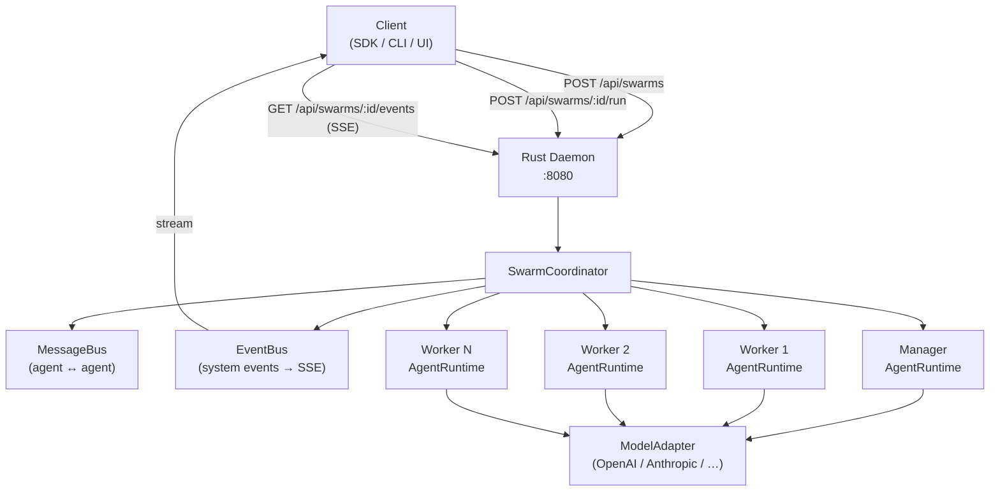
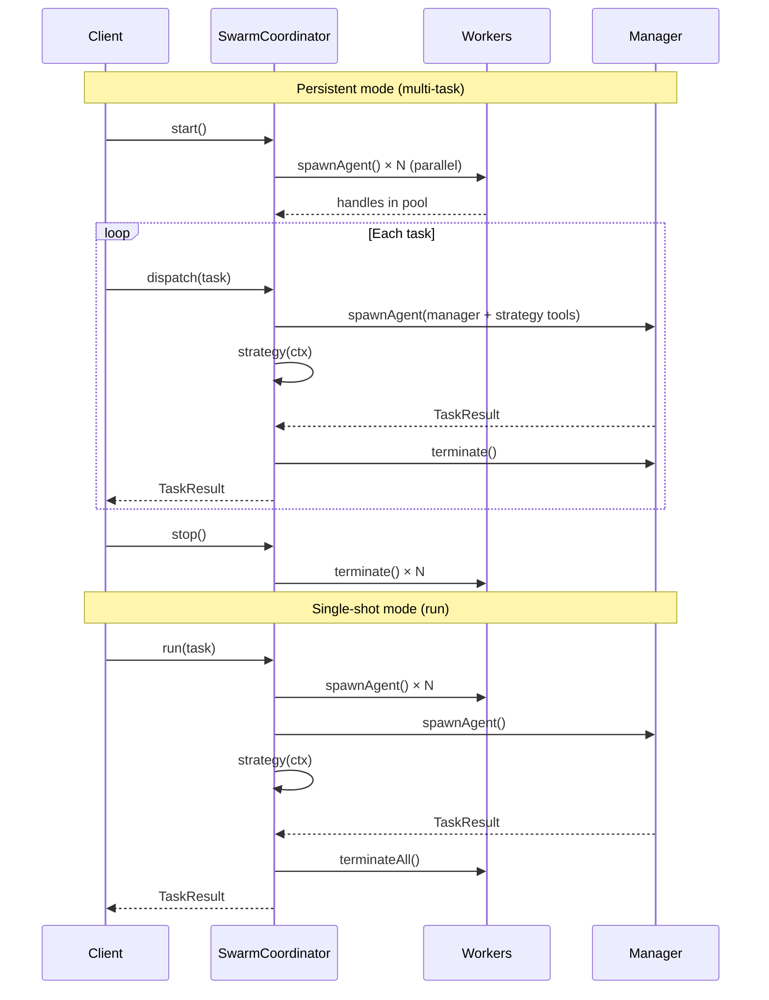
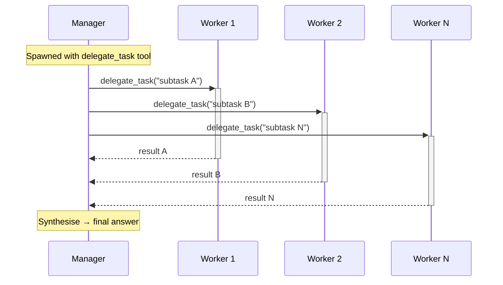
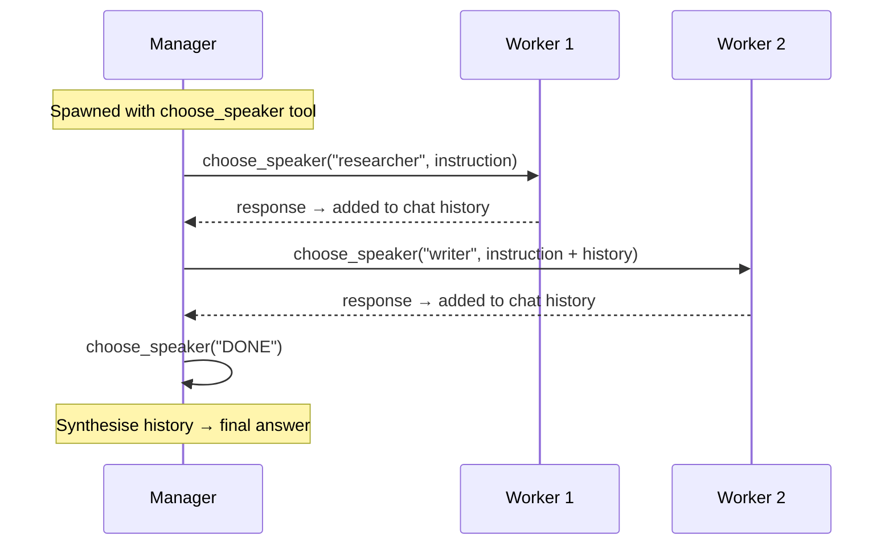
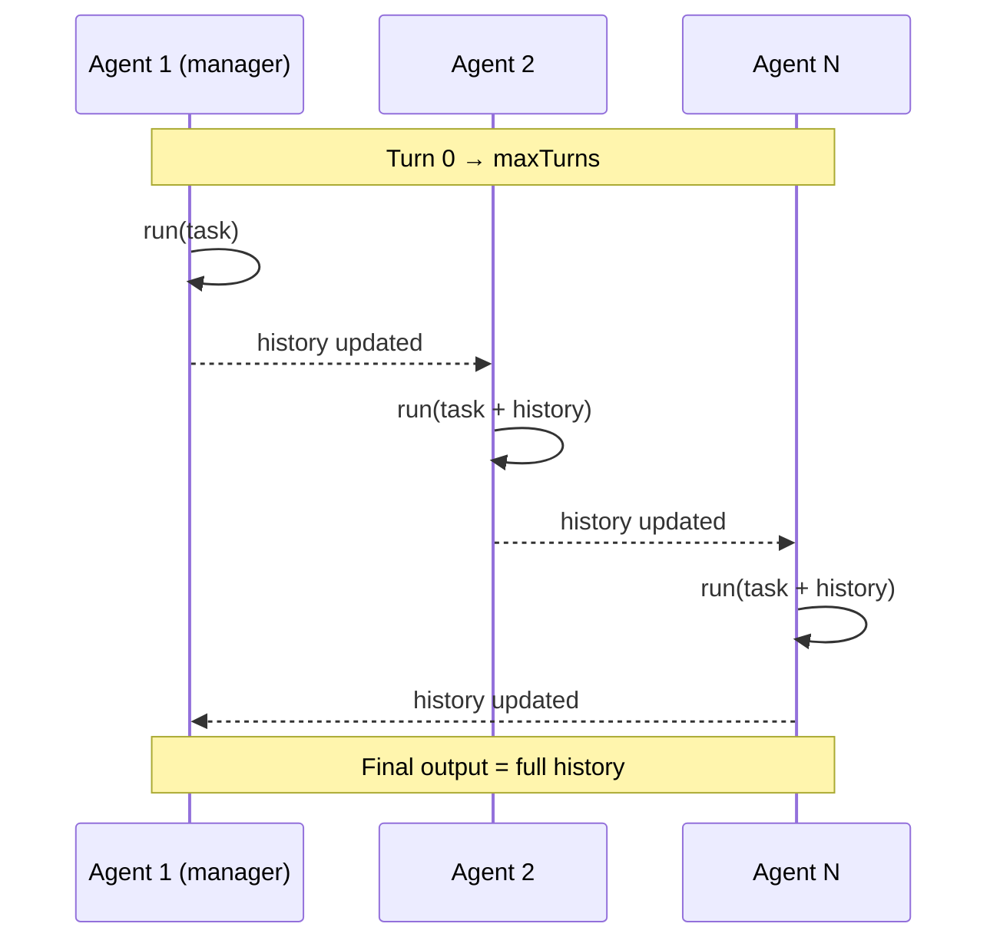
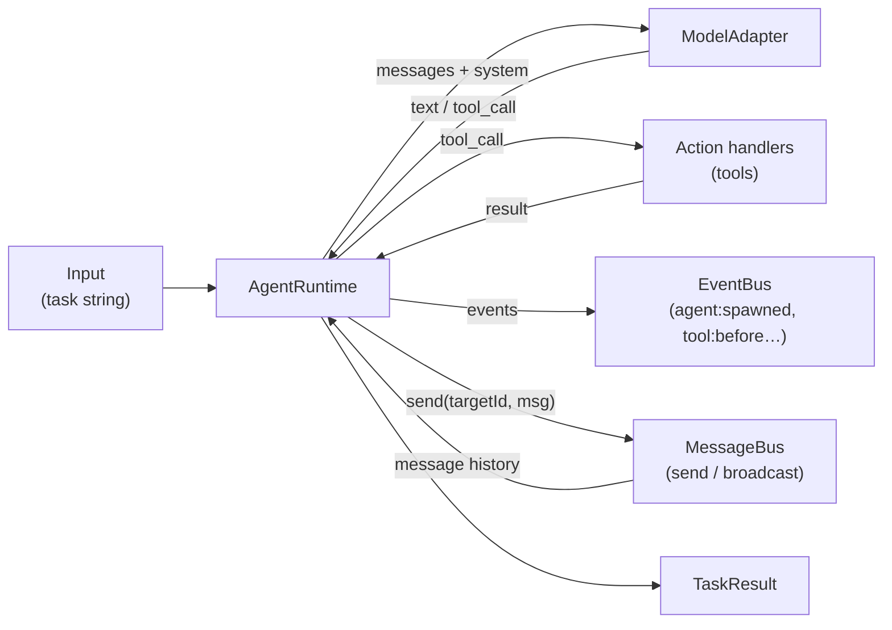

# Swarm Agent Architecture

## System Overview

## Swarm Lifecycle

## Strategy: Supervisor

Manager breaks the task down and delegates subtasks to workers in parallel. Manager synthesises all results. Agents can also use swarm messaging tools to send direct handoffs or broadcast context through the shared message bus.

**Best for:** tasks that decompose cleanly into parallel subtasks (research + write + review, data pipeline stages).

---

## Strategy: Dynamic

Manager acts as an orchestrator with a `choose_speaker` tool. It picks which worker speaks next based on the evolving conversation, building shared context turn by turn.

**Best for:** tasks that need adaptive, back-and-forth reasoning where the manager decides who contributes next.

---

## Strategy: Round Robin

All agents (manager + workers) take turns in a fixed cycle. Each agent sees the full conversation history before responding. No tool use — pure sequential turns.

**Best for:** creative or iterative tasks where each agent builds on what came before (story generation, code review cycles, debate).

---

## Agent Internals

Swarm snapshots include the global message history as `messages`, so direct sends and broadcasts are inspectable through `POST /api/swarms/:id/run`, `GET /api/swarms/:id`, list responses, and SSE state payloads.

## Event Flow (SSE)

Events emitted by `EventBus` are streamed to connected clients via `GET /api/swarms/:id/events`.

| Event | When |
|---|---|
| `swarm:created` | Swarm starts |
| `agent:spawned` | An AgentRuntime is initialised |
| `tool:before` | Agent is about to call a tool |
| `tool:after` | Tool call completed |
| `agent:completed` | Agent finished a run |
| `swarm:completed` | Task done, result ready |
| `swarm:stopped` | Swarm shut down |
