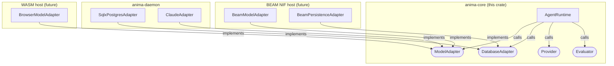
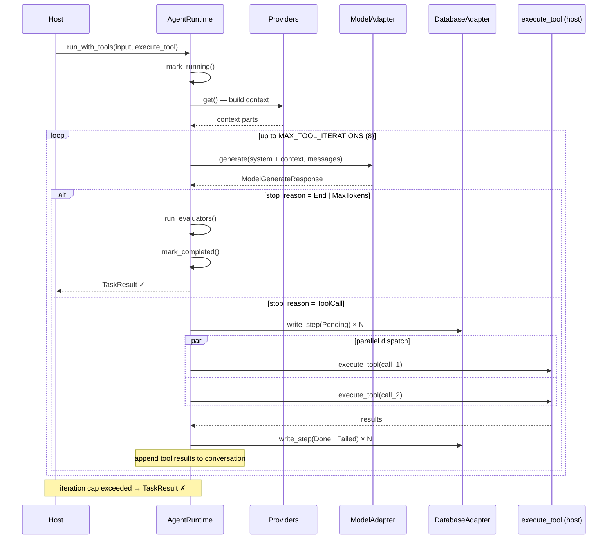
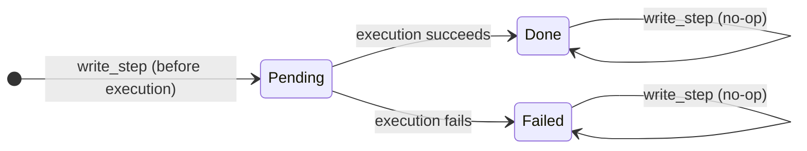

# anima-core

The execution engine for AnimaOS agents. A pure Rust library with no HTTP server, no database driver, and no async runtime dependency. All host-specific concerns are injected through traits at construction time.

## Contents

- [Architecture](#architecture)
- [Core Traits](#core-traits)
- [Agent Execution Loop](#agent-execution-loop)
- [Step Checkpointing](#step-checkpointing)
- [Events](#events)
- [Implementing a Host](#implementing-a-host)
- [Adding a New Tool](#adding-a-new-tool)
- [Executor Compatibility](#executor-compatibility)

---

## Architecture

`anima-core` owns the agent runtime and nothing else. It defines the shapes of things — traits for model providers, databases, context providers, and evaluators — and the `AgentRuntime` struct that drives agent execution.

Hosts (anima-daemon, WASM, BEAM NIF, test harnesses) implement these traits and wire them in. The core never reaches out to anything on its own.



The arrow direction reads as dependency: the core defines the trait, the host provides the implementation. `anima-core` has zero knowledge of any host.

---

## Core Traits

### `ModelAdapter`

```rust
#[async_trait]
pub trait ModelAdapter: Send + Sync {
    fn provider(&self) -> &str;
    async fn generate(
        &self,
        config: &AgentConfig,
        request: &ModelGenerateRequest,
    ) -> Result<ModelGenerateResponse, String>;
}
```

Wraps any LLM. The response carries a `ModelStopReason` — `End`, `MaxTokens`, or `ToolCall` — which determines what the runtime does next. Required at construction time; there is no default.

### `DatabaseAdapter`

```rust
#[async_trait]
pub trait DatabaseAdapter: Send + Sync {
    async fn write_step(&self, step: &Step) -> PersistenceResult<()>;
    async fn get_step_by_idempotency_key(
        &self,
        agent_id: &str,
        key: &str,
    ) -> PersistenceResult<Option<Step>>;
    async fn list_agent_steps(&self, agent_id: &str) -> PersistenceResult<Vec<Step>>;
}
```

Checkpoint store for tool call state. Optional — inject via `set_database()`. When absent the runtime runs statelessly. `write_step` is called twice per tool call: once before execution (`Pending`) and once after (`Done` or `Failed`). Implementations must be idempotent: a second write to the same `(agent_id, step_index)` must not overwrite a terminal state.

### `Provider`

```rust
#[async_trait]
pub trait Provider: Send + Sync {
    fn name(&self) -> &str;
    fn description(&self) -> &str;
    async fn get(
        &self,
        runtime: &AgentRuntime,
        message: &Message,
    ) -> Result<ProviderResult, String>;
}
```

Enriches the system prompt before each LLM call. Common uses: memory retrieval, RAG, user profile injection. Providers run in sequence; their text output is appended to the system prompt.

### `Evaluator`

```rust
#[async_trait]
pub trait Evaluator: Send + Sync {
    fn name(&self) -> &str;
    fn description(&self) -> &str;
    async fn validate(&self, runtime: &AgentRuntime, message: &Message) -> Result<bool, String>;
    async fn evaluate(
        &self,
        runtime: &AgentRuntime,
        message: &Message,
        response: &Content,
    ) -> Result<EvaluatorResult, String>;
}
```

Runs after the model returns a final answer (not after tool calls). Can score, flag, or append follow-up content. If `validate` returns `false`, the evaluator is skipped for that turn.

---

## Agent Execution Loop

The loop lives in `AgentRuntime::run_with_tools`.



Tool calls within a single model response are dispatched in parallel. The model sees all results before generating its next response. The `DatabaseAdapter` steps are skipped when no database is injected.

---

## Step Checkpointing

Every tool call is durably checkpointed before and after execution. This gives you exactly-once execution semantics across restarts.

### Step structure

```rust
pub struct Step {
    pub id: String,              // UUID, unique per write
    pub agent_id: String,
    pub step_index: i32,         // monotonically increasing per agent
    pub idempotency_key: String, // "{agent_id}:{step_index}:{tool_call.id}"
    pub step_type: String,       // "tool" (extensible)
    pub status: StepStatus,      // Pending | Done | Failed
    pub input: Option<Value>,    // { name, args }
    pub output: Option<Value>,   // { status, data, error }
}
```

### State machine



`Done` and `Failed` are terminal. A `write_step` call against a terminal step must be a no-op — both the `InMemoryAdapter` (tests) and `SqlxPostgresAdapter` (daemon) enforce this with conditional logic.

### Idempotency key

```
{agent_id}:{step_index}:{tool_call.id}
```

Step index is positional — assigned by `enumerate()` over the tool calls batch, then atomically advanced via `step_counter`. This is stable regardless of what the model puts in `tool_call.id`.

### Persistence errors are non-fatal

A failure to write a step is logged as an `AgentMessage` event but does not abort the task. The agent keeps running. If the database is unavailable, the task completes without durability guarantees — the same behaviour as running without a `DatabaseAdapter` at all.

---

## Events

`AgentRuntime` emits `EngineEvent` values throughout execution. Register a listener with `set_event_listener`:

```rust
runtime.set_event_listener(Arc::new(|event| {
    println!("{}: {:?}", event.event_type.as_str(), event.data);
}));
```

All events are also stored in `runtime.events()` for later inspection.

### Event types

| Event string | When emitted |
|---|---|
| `agent:spawned` | After `init()` |
| `agent:started` | When `run` begins |
| `agent:completed` | Task finished successfully |
| `agent:failed` | Task ended in error |
| `agent:terminated` | `stop()` called |
| `agent:message` | Every message recorded (user, assistant, tool) |
| `agent:tokens` | After each LLM response |
| `task:started` | Same tick as `agent:started` |
| `task:completed` | Same tick as `agent:completed` |
| `task:failed` | Same tick as `agent:failed` |
| `tool:before` | Before tool dispatch |
| `tool:after` | After tool result received |

---

## Implementing a Host

A host is any process that constructs an `AgentRuntime`, implements the required traits, and drives tasks. Here is the minimal wiring:

```rust
use std::sync::Arc;
use anima_core::runtime::AgentRuntime;
use anima_core::agent::AgentConfig;

// 1. Implement ModelAdapter for your LLM
struct MyModel;

#[async_trait]
impl ModelAdapter for MyModel {
    fn provider(&self) -> &str { "my-model" }

    async fn generate(
        &self,
        _config: &AgentConfig,
        request: &ModelGenerateRequest,
    ) -> Result<ModelGenerateResponse, String> {
        // call your LLM API here
        todo!()
    }
}

// 2. Optionally implement DatabaseAdapter
// (skip if you don't need persistence)

// 3. Construct and run
let config = AgentConfig {
    name: "my-agent".to_string(),
    ..Default::default()
};

let mut runtime = AgentRuntime::new(config, Arc::new(MyModel));

// Inject persistence (optional)
runtime.set_database(Arc::new(my_db_adapter));

// Inject context providers (optional)
runtime.register_provider(Arc::new(my_provider));

// Inject evaluators (optional)
runtime.register_evaluator(Arc::new(my_evaluator));

// Subscribe to events (optional)
runtime.set_event_listener(Arc::new(|e| { /* ... */ }));

runtime.init();

// Run a task
let result = runtime.run_with_tools(
    Content { text: "What is 2 + 2?".to_string() },
    |_state, _message, tool_call| async move {
        match tool_call.name.as_str() {
            "calculator" => { /* ... */ TaskResult::success(Content { text: "4".to_string() }, 0) }
            name => TaskResult::error(format!("unknown tool: {name}"), 0),
        }
    },
).await;
```

The `execute_tool` closure receives a cloned `AgentState` and the originating user `Message`, so it has everything needed to log, route, or audit the call.

---

## Adding a New Tool

Tools are not registered in `anima-core`. They are resolved at runtime inside the `execute_tool` closure you pass to `run_with_tools`. This keeps the core free of tool-specific dependencies.

To add a tool:

1. Add a branch to your `execute_tool` match:

```rust
"my_tool" => {
    let arg = tool_call.args.get("input")
        .and_then(|v| v.as_str())
        .unwrap_or("");
    let output = do_my_thing(arg).await;
    TaskResult::success(Content { text: output }, 0)
}
```

2. Include the tool schema in your `AgentConfig` so the model knows to call it:

```rust
config.tools = Some(vec![
    ToolDefinition {
        name: "my_tool".to_string(),
        description: "Does my thing".to_string(),
        parameters: serde_json::json!({
            "type": "object",
            "properties": {
                "input": { "type": "string" }
            },
            "required": ["input"]
        }),
    }
]);
```

The runtime handles parallel dispatch, step checkpointing, and result injection automatically.

---

## Executor Compatibility

`anima-core` uses standard `std::future::Future` and `async_trait`. It does not directly depend on `tokio`, `async-std`, or any other runtime.

- **tokio** (anima-daemon): `#[tokio::main]` drives the futures
- **BEAM NIF** (future Elixir host): futures polled from a NIF thread pool
- **WASM** (future browser host): futures driven by the browser event loop via `wasm-bindgen-futures`
- **Tests**: `#[tokio::test]` or any compatible test executor

Swapping the executor does not require changes to `anima-core`.
