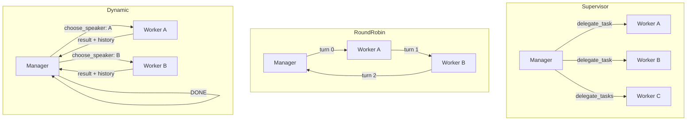

# anima-swarm

`anima-swarm` coordinates multiple `anima-core` agents working together on a shared task. A `SwarmCoordinator` manages a pool of worker agents and a manager agent, executing one of three dispatch strategies that determine how the manager and workers communicate and share work. The coordinator handles agent lifecycle, concurrency limits, token tracking, and an internal message bus that agents can use to communicate with each other mid-swarm.

---

## Strategies

| Strategy | How it works | When to use |
|---|---|---|
| `Supervisor` | The manager receives `delegate_task` and `delegate_tasks` tools. It decides which named worker handles each subtask and can fan out multiple delegations concurrently up to `max_parallel_delegations`. Workers are spawned once and reused. | Tasks that decompose into clearly distinct subtasks, each suited to a specific worker. Best when you know at design time what the workers are good at. |
| `RoundRobin` | All agents (manager + workers) take turns responding in a fixed cycle for `max_turns` turns. Each turn passes the full conversation history to the active agent. No manager-directed delegation — every agent speaks in sequence. | Iterative refinement, brainstorming, or critique workflows where all agents should contribute equally and the task benefits from multiple passes. |
| `Dynamic` | The manager receives a `choose_speaker` tool. Each turn the manager picks which worker speaks next and provides an instruction. When the manager signals `DONE`, it synthesizes the conversation and returns. Workers are spawned once and accumulate a shared history. | Open-ended tasks where the right sequence of workers is not known in advance and the manager needs to route based on partial results. |

### Strategy topology



---

## Quick usage

```rust
use anima_core::AgentConfig;
use anima_swarm::{SwarmConfig, SwarmCoordinator, SwarmStrategy};

let config = SwarmConfig {
    strategy: SwarmStrategy::Supervisor,
    manager: AgentConfig {
        name: "manager".into(),
        model: "claude-3-5-sonnet-latest".into(),
        ..Default::default()
    },
    workers: vec![
        AgentConfig {
            name: "researcher".into(),
            model: "claude-3-5-haiku-latest".into(),
            ..Default::default()
        },
        AgentConfig {
            name: "writer".into(),
            model: "claude-3-5-haiku-latest".into(),
            ..Default::default()
        },
    ],
    max_concurrent_agents: None,
    max_parallel_delegations: Some(2),
    max_turns: None,
    token_budget: None,
};

let coordinator = SwarmCoordinator::with_config(config);

// Optional: pre-warm workers before the first dispatch.
coordinator.start().await?;

let result = coordinator.dispatch("Write a technical overview of Rust's ownership model").await;
println!("{}", result.data.unwrap().text);

// Inspect token usage and run history.
let state = coordinator.get_state();
println!("tokens used: {}", state.token_usage.total_tokens);

// Shut down and stop all agents.
coordinator.stop().await?;
```

For custom agent construction (e.g., wiring up a real LLM backend), use `SwarmCoordinator::with_hooks` and supply your own `agent_factory`.

---

## SwarmConfig fields

| Field | Type | What it controls |
|---|---|---|
| `strategy` | `SwarmStrategy` | Which dispatch strategy the coordinator runs (`Supervisor`, `RoundRobin`, or `Dynamic`). |
| `manager` | `AgentConfig` | Configuration for the manager agent — the agent that drives delegation or turn-taking. |
| `workers` | `Vec<AgentConfig>` | Worker agent configurations. Order matters for `RoundRobin` (agents cycle in declaration order). |
| `max_concurrent_agents` | `Option<usize>` | Hard cap on how many agent instances can be alive at one time. `None` means unlimited. |
| `max_parallel_delegations` | `Option<usize>` | Maximum number of worker tasks that can run simultaneously in `Supervisor` mode. Defaults to the number of workers. |
| `max_turns` | `Option<usize>` | Maximum number of turns or delegation rounds. In `RoundRobin` this is the total turn count. In `Supervisor`/`Dynamic` it bounds manager iterations. Defaults to `workers.len() + 1`. |
| `token_budget` | `Option<u64>` | Reserved field for a future token-budget enforcement feature. Not enforced by the coordinator today. |

---

## MessageBus

The `MessageBus` is an internal pub/sub channel that agents can use to pass structured `Content` to each other while a task is in flight. Each registered agent has its own inbox. `send(from, to, content)` delivers a message to one named recipient; `broadcast(from, content)` delivers to every other registered agent. Receivers call `get_messages(agent_id)` to drain their inbox. The bus is accessible from the coordinator via `get_message_bus()`, which returns an `Arc<Mutex<MessageBus>>` that strategy implementations hold during dispatch. Inboxes are cleared at the start of each `dispatch` call so stale messages from a prior run never bleed into the next. `clear()` wipes all messages and inboxes entirely; `clear_inboxes()` empties inboxes while leaving the agent registration intact.
